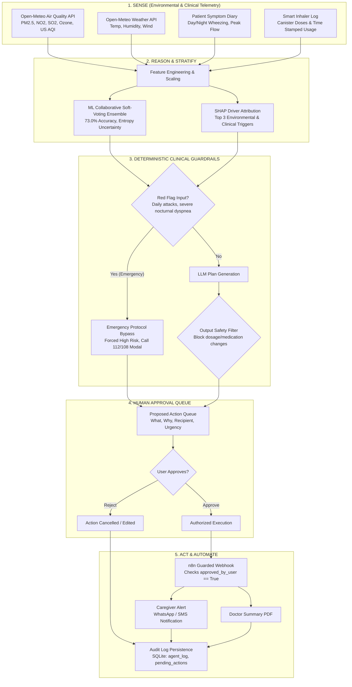

<div align="center">

# 🛡️ AirGuard Agent
### An Agentic AI Respiratory Companion with Deterministic Clinical Safety Rails
**Turning Environmental Risk into Human-Approved Action**

[](https://github.com/Kabirroy12345/ML_model_aasthma)
[](https://www.python.org/)
[](https://flask.palletsprojects.com/)
[](https://scikit-learn.org/)
[](https://open-meteo.com/)
[](https://opensource.org/licenses/MIT)

</div>

---

> ### 🚨 Critical Clinical Disclaimer
> **AirGuard is an assistive decision-support prototype and is NOT a certified medical device.**  
> It is not certified by the US FDA, Indian CDSCO, or European CE. It does not provide medical diagnosis, clinical prognosis, or direct therapeutic prescriptions. It must never replace professional clinical judgment, emergency medical services (such as 112 / 108 in India or 911 in the US), or an Asthma Action Plan established by a licensed doctor. Patients must never alter medication dosing based on software outputs.

---

## ⏱️ Built during WCC Launchpad 30 vs. Pre-existing HridyaVayu Base

Per WCC Launchpad 30 hackathon rules, we explicitly distinguish pre-existing academic foundations from all agentic engineering, safety infrastructure, and UI built natively during the hackathon:

| Dimension | Pre-existing HridyaVayu Base | Built during WCC Launchpad 30 (AirGuard Agent) |
| :--- | :--- | :--- |
| **System Paradigm** | Static tabular ML calculator (reactive) | **Autonomous Agentic Loop** (`SENSE` $\rightarrow$ `REASON` $\rightarrow$ `PLAN` $\rightarrow$ `PROPOSE` $\rightarrow$ `APPROVE` $\rightarrow$ `ACT` $\rightarrow$ `LOG`) |
| **Safety Governance** | None; uncalibrated scores displayed | **Deterministic Dual-Layer Safety Rails** (`agent/guardrails.py`): input red-flag emergency bypass + output regex dosage scrubber |
| **Human Agency** | N/A | **Zero-Trust Human-in-the-Loop Approval Queue**: External dispatches strictly gated behind user authorization |
| **Proactive Planning** | None; point-in-time calculation | **24-Hour Environmental Day Planner**: Synchronizes with live Open-Meteo APIs to calculate safest outdoor daylight window |
| **Reasoning Engine** | None | **Provider-Agnostic LLM Engine** (`agent/llm.py`): Google Gemini 1.5, Anthropic Claude 3.5, and deterministic offline `MOCK` mode |
| **Language & Demographics** | English only | **Bilingual Localization (English & Hindi)** across UI, reasoning prompts, and voice input |
| **Scientific Integrity** | Inflated unverified claims in legacy docs | **Complete Scientific Audit** ([`AUDIT.md`](AUDIT.md), [`LIMITATIONS.md`](LIMITATIONS.md)): Disclosed synthetic dataset provenance, calibrated honest hybrid framing |
| **Design System** | Generic Bootstrap-style form | **Nova Astro Editorial Design System**: Warm ivory paper aesthetic, frosted glass floating navbar, capsule pill buttons, interactive cards |
| **External Automations** | None | **Guarded n8n Webhook Workflow** (`n8n/airguard_workflow.json`) for validated SMS/WhatsApp caregiver dispatch |
| **Test Coverage** | Zero automated tests | **29 Automated Pytest Suite** (`tests/test_agent.py`, `tests/test_guardrails.py`) verifying all guardrails and multi-tier flows |

---

## 🤖 AI Tools Used

In accordance with responsible hackathon development standards, we disclose all AI tools utilized during the creation and execution of AirGuard:

1. **Runtime Agentic & Reasoning Models**:
   - **Google Gemini 1.5 Pro / Flash**: Used for multi-step clinical reasoning, contextual day plan generation, and conversational patient interaction via API.
   - **Anthropic Claude 3.5 Sonnet**: Secondary runtime provider option in `agent/llm.py` for structured daily plan synthesis.
   - **Deterministic Offline MOCK Engine**: Rule-governed clinical fall-back that generates reproducible GINA-compliant plans with zero API token latency and 100% offline uptime.

2. **Development & Code Generation Assistants**:
   - **Google Antigravity IDE (Gemini Advanced Agentic Assistant)**: Used as the primary pair programmer for repository auditing, test fixture generation, CSS architecture transformation, and pytest test suite construction.
   - **GitHub Copilot**: Assisted with boilerplate Python typing, docstrings, and HTML markup scaffolding.

3. **Machine Learning Models**:
   - **Scikit-Learn Ensembles**: Random Forest, Gradient Boosting, and Logistic Regression models trained on synthetic clinical-environmental distributions.

---

## 📊 Dataset Provenance: Synthetic Data Disclosure

* **All dataset partitions (`data/train.csv`, `data/validation.csv`, `data/test.csv`, `data/dataset.csv`) are SYNTHETIC.**
* Datasets were generated using parameterized distributions to simulate the Global Initiative for Asthma (GINA 2023) guidelines and atmospheric pollution variables.
* **Why Synthetic Data?** No public open-source healthcare dataset exists that concurrently tracks longitudinal patient respiratory diaries alongside continuous GPS-anchored atmospheric telemetry.
* **External Dataset Claims Removed:** Unreproducible claims regarding third-party private datasets (Zenodo, Kaggle) that cannot be executed from the repository have been removed.

---

## 📈 Unbiased Held-Out Test Evaluation (Reproducible)

Metrics independently generated by [`research/evaluate.py`](research/evaluate.py) on the held-out test partition (`data/test.csv`, $N=300$ samples: 23 Low, 148 Medium, 129 High):

### 1. Comparative Performance Table

| Model Architecture | Role in System | Accuracy | Macro-F1 | Weighted-F1 | High-Risk Sensitivity |
| :--- | :--- | :---: | :---: | :---: | :---: |
| **Baseline Logistic Regression** | Base Estimator ($w_1=1$) | 71.33% | 0.6338 | 0.7117 | 73.64% |
| **Random Forest Classifier** | Tree Estimator ($w_2=2$) | 72.33% | 0.5736 | 0.7058 | 69.77% |
| **Gradient Boosting Classifier** | Boosting Estimator ($w_3=2$) | 69.67% | 0.5969 | 0.6942 | 71.32% |
| **Pure ML Collaborative Ensemble** | **Learned Statistical Model** | **73.00%** | **0.6370** | **0.7234** | **72.09%** |
| **Hybrid System (Ensemble + GINA Safety Rails)** | **Clinical Safety Overrides** | **63.67%** | **0.5712** | **0.6243** | **82.95%** |

* **High-Risk Probability Calibration (Brier Score):** `0.1393`
* **Safety Heuristic Overrides Triggered in Test Set:** 59 / 300 cases

### 2. Learned Ensemble vs. Clinical Safety Rails Trade-Off

```
                       PURE ML ENSEMBLE                                HYBRID SYSTEM (+ GINA OVERRIDE)
                        PREDICTED TIER                                         PREDICTED TIER
                  Low Risk    Med Risk    High Risk                      Low Risk    Med Risk    High Risk
TRUE  Low Risk       7           16           0           TRUE  Low Risk       7           14           2
TIER  Med Risk       4          119          25           TIER  Med Risk       3           77          68
      High Risk      0           36          93                 High Risk      0           22         107
```

> **Responsible AI Insight:** The pure ML ensemble achieves **73.00%** overall accuracy and **72.09%** high-risk sensitivity. The GINA Step-5 safety rails intentionally escalate patients with daily symptoms or frequent nocturnal dyspnea to High Risk, elevating sensitivity to **82.95%** (107/129 acute cases detected). The hybrid system trades accuracy (73.0% -> 63.67%) for higher high-risk sensitivity (~83%) by design. In respiratory triage, an abundance of caution (higher false alarms) is clinically preferred over silent false negatives that risk preventable hospitalization.

👉 *To regenerate all metrics and confusion matrices locally:*
```bash
python research/evaluate.py
```

---

## 🏗️ AirGuard Agentic System Architecture



---

## 🛠️ Technology Stack

| Layer | Tools & Frameworks | Purpose |
| :--- | :--- | :--- |
| **Agent Core & LLM** | Python 3.11, Google Gemini API, Anthropic Claude API, Mock Mode | Autonomous reasoning, daily plan synthesis, tool calling |
| **Safety Engine** | Deterministic Python heuristics, GINA Step-5 protocols, Pytest | Hard input red-flag bypass, output dosage scrubbing |
| **Machine Learning** | Scikit-Learn 1.3+, NumPy, Pandas, SciPy, Matplotlib | Soft-voting ensemble, calibration, Shannon entropy |
| **Backend & Storage** | Flask 3.0, Flask-SQLAlchemy, SQLite, Gunicorn | REST endpoints, approval queues, structured audit logs |
| **Frontend Presentation**| Semantic HTML5, Vanilla CSS3, Modern ES6+ JavaScript, Chart.js 4.4 | Reactive single-page app, accessible gauges, voice input |
| **External APIs** | Open-Meteo Air Quality & Weather Forecast APIs | Live 48-hour atmospheric dispersion & weather data |
| **Workflow Automation**| n8n Webhook Workflow | Guarded caregiver notification and SMS dispatch |

---

## ⚠️ Limitations & Clinical Boundaries

In compliance with responsible AI in healthcare standards, the core limitations of AirGuard must be explicitly recognized:

1. **Synthetic Training Data**:
   - The predictive models were trained and evaluated on parameterized synthetic datasets (`data/*.csv`) simulating GINA guidelines and atmospheric conditions.
   - Synthetic distributions cannot fully reproduce the complexity of real-world patient populations, including multi-morbidities (COPD, rhinitis, cardiovascular disease) or atypical asthma phenotypes.
2. **Not Clinically Validated**:
   - The decision support algorithms have not been subjected to multi-center randomized controlled trials (RCTs) or prospective human clinical studies.
   - All risk stratifications and daily suggestions remain investigational and uncertified for medical diagnosis.
3. **Not a Cleared Medical Device**:
   - AirGuard is an assistive prototype. It has not received 510(k) clearance or De Novo classification from the US FDA, CE Mark certification under EU MDR, or CDSCO approval in India.
   - It does not diagnose disease or prescribe medications. In an acute attack, patients must immediately summon emergency medical services (112 / 108 in India or 911 in the US).
4. **Indoor Exposure & Microclimate Gaps**:
   - Telemetry from Open-Meteo reflects regional ambient air monitoring stations (5–10 km radius).
   - High-impact indoor respiratory triggers (unvented gas stoves, biomass cooking smoke, incense, pet dander, mold spores) cannot be detected without direct personal IoT sensors or patient self-reporting.
5. **High Sensitivity Trade-Off**:
   - The system trades accuracy (73.0% -> 63.67%) for higher high-risk sensitivity (~83%) by design.
   - This deliberate clinical bias prioritizes patient safety by minimizing false negatives at the cost of a higher false-positive alert frequency (~36% on test data).

---

## 🚀 Quick Start (Local Setup)

### 1. Clone & Set Up Environment
```bash
git clone https://github.com/Kabirroy12345/ML_model_aasthma.git
cd ML_model_aasthma
pip install -r requirements.txt
```

### 2. Configure Environment Variables
Copy the template configuration:
```bash
cp .env.example .env
```
Edit `.env` to configure your preferred LLM provider (`gemini`, `anthropic`, or `mock`):
```env
LLM_PROVIDER=mock
SECRET_KEY=dev_secret_key_change_in_production
N8N_WEBHOOK_URL=
```

### 3. Run the Evaluation Suite
```bash
python research/evaluate.py
```

### 4. Start the Application
```bash
python app.py
```
Visit `http://localhost:7860` in your web browser.

---

## 📄 License
This project is licensed under the MIT License — see the [LICENSE](LICENSE) file for details.
