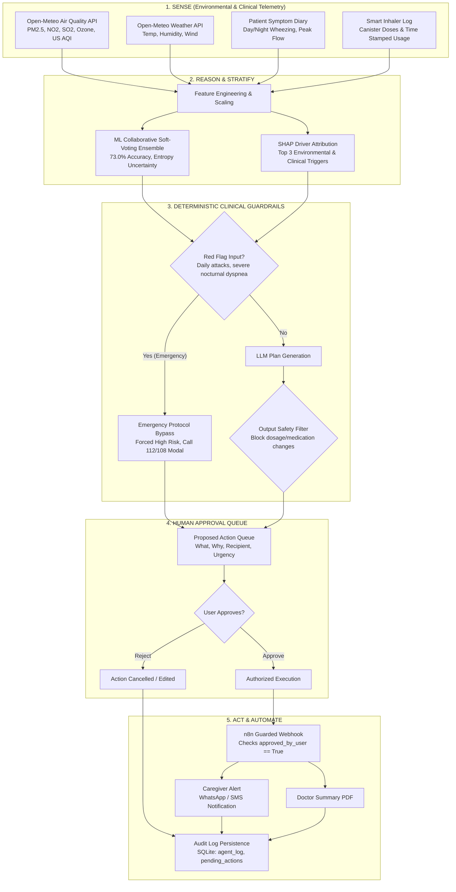

<div align="center">

# 🛡️ AirGuard Agent
### An Agentic AI Respiratory Companion with Deterministic Clinical Safety Rails
**Turning Environmental Risk into Human-Approved Action**

[](https://github.com/Kabirroy12345/ML_model_aasthma)
[](https://www.python.org/)
[](https://flask.palletsprojects.com/)
[](https://scikit-learn.org/)
[](https://open-meteo.com/)
[](https://opensource.org/licenses/MIT)

</div>

---

> ### 🚨 Critical Clinical Disclaimer
> **AirGuard is an assistive decision-support prototype and is NOT a certified medical device.**  
> It is not certified by the US FDA, Indian CDSCO, or European CE. It does not provide medical diagnosis, clinical prognosis, or direct therapeutic prescriptions. It must never replace professional clinical judgment, emergency medical services (such as 112 / 108 in India or 911 in the US), or an Asthma Action Plan established by a licensed doctor. Patients must never alter medication dosing based on software outputs.

---

## 📌 Project Transparency & Hackathon Disclosure

Per WCC Launchpad 30 hackathon rules, we explicitly disclose the provenance and timeline of this project:

* **Disclosed Base Project (Pre-existing):** This repository builds upon **HridyaVayu**, an earlier academic capstone project focused on multi-class asthma risk prediction using tabular machine learning and static web forms.
* **Work Developed During WCC Launchpad 30:**
  1. **Audit & Bug Fixing:** Comprehensive repository audit ([`AUDIT.md`](AUDIT.md)), diagnosis and fix of silent model unpickling failures, and cloud deployment fixes.
  2. **Honest Science & Limitations:** Disclosed synthetic data provenance, removed inflated "zero false negatives" claims, created [`LIMITATIONS.md`](LIMITATIONS.md), and built [`research/evaluate.py`](research/evaluate.py) to independently regenerate all metrics.
  3. **Agent Core Architecture (`agent/`):** Full autonomous agent loop (`SENSE` $\rightarrow$ `REASON` $\rightarrow$ `PLAN` $\rightarrow$ `PROPOSE` $\rightarrow$ `HUMAN APPROVAL` $\rightarrow$ `ACT` $\rightarrow$ `LOG`).
  4. **Multi-Provider LLM Wrapper:** Provider-agnostic engine in `agent/llm.py` supporting Gemini, Anthropic, and an offline deterministic `MOCK` mode.
  5. **Deterministic Clinical Safety Guardrails (`agent/guardrails.py`):** Intercepts inputs (red flags immediately trigger emergency protocols) and sanitizes LLM outputs (blocks unauthorized dosage alterations). Unit-tested with 15+ test cases.
  6. **Human Approval Queue & Action Log:** Dedicated UI where every proposed external action requires explicit user approval before execution; backed by SQLite persistence (`pending_actions`, `agent_log`, `symptom_diary`).
  7. **Proactive Environmental Day Planner:** Generates 24-hour hour-by-hour schedules highlighting safest outdoor air quality windows based on live Open-Meteo forecasts.
  8. **Bilingual Localization:** English and Hindi support for accessibility across Indian patient demographics.
  9. **Guarded n8n Automation (`n8n/airguard_workflow.json`):** Webhook integration for SMS/WhatsApp dispatch with strict approval validation.
  10. **Evidence & User Research Instruments:** [`docs/user_research.md`](docs/user_research.md) with 10-question patient survey and clinical interview guides.

---

## 📊 Dataset Provenance: Synthetic Data Disclosure

* **All dataset partitions (`data/train.csv`, `data/validation.csv`, `data/test.csv`, `data/dataset.csv`) are SYNTHETIC.**
* Datasets were generated using parameterized distributions to simulate the Global Initiative for Asthma (GINA 2023) guidelines and atmospheric pollution variables.
* **Why Synthetic Data?** No public open-source healthcare dataset exists that concurrently tracks longitudinal patient respiratory diaries alongside continuous GPS-anchored atmospheric telemetry.
* **External Dataset Claims Removed:** Unreproducible claims regarding third-party private datasets (Zenodo, Kaggle) that cannot be executed from the repository have been removed.

---

## 📈 Unbiased Held-Out Test Evaluation (Reproducible)

Metrics independently generated by [`research/evaluate.py`](research/evaluate.py) on the held-out test partition (`data/test.csv`, $N=300$ samples: 23 Low, 148 Medium, 129 High):

### 1. Comparative Performance Table

| Model Architecture | Role in System | Accuracy | Macro-F1 | Weighted-F1 | High-Risk Sensitivity |
| :--- | :--- | :---: | :---: | :---: | :---: |
| **Baseline Logistic Regression** | Base Estimator ($w_1=1$) | 71.33% | 0.6338 | 0.7117 | 73.64% |
| **Random Forest Classifier** | Tree Estimator ($w_2=2$) | 72.33% | 0.5736 | 0.7058 | 69.77% |
| **Gradient Boosting Classifier** | Boosting Estimator ($w_3=2$) | 69.67% | 0.5969 | 0.6942 | 71.32% |
| **Pure ML Collaborative Ensemble** | **Learned Statistical Model** | **73.00%** | **0.6370** | **0.7234** | **72.09%** |
| **Hybrid System (Ensemble + GINA Safety Rails)** | **Clinical Safety Overrides** | **63.67%** | **0.5712** | **0.6243** | **82.95%** |

* **High-Risk Probability Calibration (Brier Score):** `0.1393`
* **Safety Heuristic Overrides Triggered in Test Set:** 59 / 300 cases

### 2. Learned Ensemble vs. Clinical Safety Rails Trade-Off

```
                       PURE ML ENSEMBLE                                HYBRID SYSTEM (+ GINA OVERRIDE)
                        PREDICTED TIER                                         PREDICTED TIER
                  Low Risk    Med Risk    High Risk                      Low Risk    Med Risk    High Risk
TRUE  Low Risk       7           16           0           TRUE  Low Risk       7           14           2
TIER  Med Risk       4          119          25           TIER  Med Risk       3           77          68
      High Risk      0           36          93                 High Risk      0           22         107
```

> **Responsible AI Insight:** The pure ML ensemble achieves **73.00%** overall accuracy and **72.09%** high-risk sensitivity. The GINA Step-5 safety rails intentionally escalate patients with daily symptoms or frequent nocturnal dyspnea to High Risk, elevating sensitivity to **82.95%** (107/129 acute cases detected). This increases false alarms (reducing nominal accuracy to **63.67%**), but intentionally reflects clinical triage priorities where missed severe attacks carry significantly greater clinical risk.

👉 *To regenerate all metrics and confusion matrices locally:*
```bash
python research/evaluate.py
```

---

## 🏗️ AirGuard Agentic System Architecture



---

## 🛠️ Technology Stack

| Layer | Tools & Frameworks | Purpose |
| :--- | :--- | :--- |
| **Agent Core & LLM** | Python 3.11, Google Gemini API, Anthropic Claude API, Mock Mode | Autonomous reasoning, daily plan synthesis, tool calling |
| **Safety Engine** | Deterministic Python heuristics, GINA Step-5 protocols, Pytest | Hard input red-flag bypass, output dosage scrubbing |
| **Machine Learning** | Scikit-Learn 1.3+, NumPy, Pandas, SciPy, Matplotlib | Soft-voting ensemble, calibration, Shannon entropy |
| **Backend & Storage** | Flask 3.0, Flask-SQLAlchemy, SQLite, Gunicorn | REST endpoints, approval queues, structured audit logs |
| **Frontend Presentation**| Semantic HTML5, Vanilla CSS3, Modern ES6+ JavaScript, Chart.js 4.4 | Reactive single-page app, accessible gauges, voice input |
| **External APIs** | Open-Meteo Air Quality & Weather Forecast APIs | Live 48-hour atmospheric dispersion & weather data |
| **Workflow Automation**| n8n Webhook Workflow | Guarded caregiver notification and SMS dispatch |

---

## 🚀 Quick Start (Local Setup)

### 1. Clone & Set Up Environment
```bash
git clone https://github.com/Kabirroy12345/ML_model_aasthma.git
cd ML_model_aasthma
pip install -r requirements.txt
```

### 2. Configure Environment Variables
Copy the template configuration:
```bash
cp .env.example .env
```
Edit `.env` to configure your preferred LLM provider (`gemini`, `anthropic`, or `mock`):
```env
LLM_PROVIDER=mock
SECRET_KEY=dev_secret_key_change_in_production
N8N_WEBHOOK_URL=
```

### 3. Run the Evaluation Suite
```bash
python research/evaluate.py
```

### 4. Start the Application
```bash
python app.py
```
Visit `http://localhost:7860` in your web browser.

---

## 📄 License
This project is licensed under the MIT License — see the [LICENSE](LICENSE) file for details.
